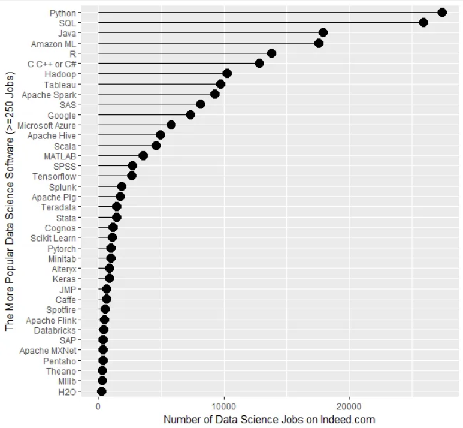

```{r setup, include=FALSE}
knitr::opts_chunk$set(comment = ">",
                      cache = TRUE,
                      cache.path = "./cache/")
options(htmltools.dir.version = FALSE,
        dplyr.width = 60,
        dplyr.print_min = 5,
        dplyr.print_max = 5)
```

## About the R Lab

.pull-left[
### Instructor
  
Victor Ritter <br/>
_Statistician_ (BS,MS) <br/>
_Brazilian_
  
_Biostatistics_ PhD Student <br/>
University North Carolina  <br/> at Chapel Hill
]

--
.pull-right[]

--
### About you?

Previous Statistical analysis software? e.g. SPSS, SAS, Minitab, Stata

Previous programming experience?

---
## Goal

Capacitance students to conduct autonomous statistical analysis using R

--
## Lab structure and assignments

Meeting from 2 to 5 pm with ~15 min break

--

- **Part 1:** coding and R programming

--

- **Part 2:** how to do statistical analysis in R

--

- **Part 3:** practice

  - Week 1 - R exercises
  
  - Week 2 - Data analysis project
  
  - Ask questions ("how do I do _this_ in R?")
  
---
## Today's Agenda

--

- Reproducible research

--

- Starting with R and RStudio

--

- Basic descriptive statistics in R

---
class: center, middle, inverse
# Part I-a
# Motivation <br/> Reproducible Research


---
## Reproducibility

- Important to ensure the "self-correcting" aspect of science

- Health sciences currently on a "reproducibility crisis"


.pull-left[
- Statistical methods play an important role on reproducibility
  - (_right_) Wassertein and Lazar (2016), _Am. Stat._ editorial 
  
- Google "reproducibility crisis"
]

.pull-right[
  
]

---
## Reproducibility

- Experimental Psychology research


.caption[The "Many Labs" Project (https://osf.io/wx7ck/)]

---
## Reproducibility

- Cancer research


  - Some studies are inherently irreproducible

--
- Two types of replication

  - <mark>  Reproduce reported results with same data (reanalysis) <mark>
  
  - Replicate the entire experiment

---
## Reproducible statistical analysis

Important steps for making reproducible analysis are

--
- Proper knowledge of the statistical methods
  - Be conscious about **P-hacking** (searching for and selective reporting of "statistically significant" results) and **HARKing** - Hypothesizing After the Results are Known - reporting _post hoc_ hypothesis as if they were a priori hypothesis

--
- Follow guidelines and protocols when possible
  - NIH (US) resources for consultation
    https://grants.nih.gov/policy/reproducibility/index.htm
  
  - Robust data management protocol
  
  - Organization and transparency
--

- Make use of the technology available
    - Dynamic/interactive reports (<mark> Rmarkdown, R Notebook <mark>) 
    
    - Version Control tools (Git, Github)

---
class: middle, center
## Why a Version Control software?


---
## Other initiatives for reproducibility

 - **EQUATOR Network** Reporting guidelines (https://www.equator-network.org/reporting-guidelines/)
   - Provide guidelines for many study designs
   
.center[]
--

 - Registered reports - **Center for Open Science** (https://cos.io/rr/)
.center[]

---
class: middle, center, inverse
# Part I-b
# Getting Started with <br/> R and Rstudio

---
## R Popularity `r emo::ji("moneybag")`

.center[]
http://r4stats.com/articles/popularity/

---
## R Popularity `r emo::ji("mortar_board")`

.center[]
http://r4stats.com/articles/popularity/

---
## Things that R is **good** at?

- _Data analysis_ - created by statisticians for statisticians

- _Visualization_ - powerful and flexible data visualization tools

- _Integration_ with other tools/languages - easy communication with SPSS, SAS, Excel, SQL, Spark, Hadoop, C/C++, Python, JavaScript, tensorflow, etc...

- Facilitates reproducibility
--

## Things that R is **not so good** good at?

- _Ease-of-use_ - steep(er) initial learning curve requires some knowledge of coding

- _Speed_ - can be slow(er) in certain tasks - e.g. loops, web scrapping

---
## R without Rstudio

.center[]
.caption[Native R GUI]

---
## R with Rstudio

Early 2011, things changed...
.center[]

---
## Exploring Rstudio

- R IDE (Integrated Development Environment)

- Let's explore a couple RStudio Menus/Tabs

- Customize your RStudio (pane locations and colors)
--

- Useful shortcuts:
  - **'Ctrl + Enter'** - send current/selected line(s) to console
  - **'Ctrl + Alt + b'** - send code up to current line
  - **'Ctrl + Shift + c'** - comment/uncomment current/selected line(s)
  - **'Ctrl + Shift + m'** - insert pipe operator ('%>%')
  - **'Alt + -'** - insert assign operator (' <- ')
  - **'Ctrl + Shift + k'** - knit RMarkdown file
  - Use **'up'** arrow key to navigate console's history 

???

knit = tejer (terrer)

---
## You've opened RStudio, now what?

Getting to know the R ecosystem:

- _Script_: develop/write/test code

- _Console_: code interpreted immediately and output is shown

- _Workspace_: directory where R is running and reading/writing files from/to

  - **Important** to be aware if your current workspace (use **`getwd()`**)
  
  - Change your workspace directory using **`setwd()`** or in RStudio's 'Session' menu

---
class: center, middle, inverse
# Let's code...


---
## R as a calculator

.pull-left[
```{r}
# addition
1 + 1

# subtraction
4 - 2

# multiplication
2 * 3

# division
5 / 3
```
]

.pull-right[
```{r}
# power
4 ^ 2

# Reminder of the division
# of 5 by 3
5 %% 3

# Integer part of the
# division of 5 by 3
5 %/% 3  
```
]


---
## Objects in R

- Atomic (single value)

- Vectors (sequence of values)

- Matrices (2-dimensional vectors)

- Data frames (matrix with data from different types)

- List (data from different times with possibly unequal lengths)

---
## Atomic objects in R

.pull-left[
```{r}
# numeric
1.2

# character
"Hello"

# integer
10L
```
]

.pull-right[
```{r}
# logical
TRUE #or just T
FALSE #or just F
```
]

---
## Atomic objects in R

Creation and assignment of values to objects

.pull-left[
```{r}
x <- 2.14
x

y = T
y

z <- "1"
z
```
]

.pull-right[

Now we can do

```{r}
x * 100
x + y
```

```r
x + z
Error in x + z: non-numeric
argument to binary operator
```
]

---
## Vectors

Think of an indexed collection of atomic objects (of same type)

```{r}
x <- c(10, 20, 30, 40)
x
x[1]
```
--

- Concatenate objects to create a vector using the **`c()`** _function_
- Access elements of a vector using the **`[ ]`** syntax
- Keep in mind that indexes in R start at 1.
- Some types trump others (`character > numeric > integer > logical`)

```{r}
x <- c(10, "A")
x
```

---
## Matrices

```{r}
m <- matrix(1:6, nrow = 2, ncol = 3)
m
m[1,1]
m[2,]
m[,3]
```

---
## Lists

```{r}
x <- list(1:5, "Z", TRUE, c("a", "b"))
x
x[[2]]
```

---
## Data frames

Think of it as Excel spreadsheets

```{r}
x <- data.frame(var1 = 1:3, var2 = c("A", "B", "C"))
x
x$var1
x[,2]
```

---
## Functions

We can call a function doing

```r
function_name(argument1, argument2, ...)
```

Like the **`length`** function

```{r}
x <- 1:10
x
length(x)
```

---
## Useful functions

```{r}
# Create a sequence
seq(from = 0, to = 10, by = 2)

# no need to write all arguments' names
seq(0, 10, 2)

# Repeat a pattern
rep(c("M", "F"), 5)

# Sort
sort(c(1, 35, 29, -19))
```

---
## Useful functions

Comparing values 
```{r}
2 <= 3
2 == as.numeric("2")

x <- 1:5
x > 3
sum(x > 3)
```

---
## Useful functions

Comparing vectors

```{r}
x <- 1:5
y <- 7:3

comp <- rep(NA, 5)
comp
for(i in 1:5){
  comp[i] <- x[i] > y[i] # Element-wise comparison
}
comp

ifelse(x > y, 1, 0) # Vectorized version
```

---
## Useful functions

Generating random numbers

```{r, fig.width=7, fig.height=4, fig.align='center'}
x <- rnorm(100, mean = 2, sd = 1)
x[1:5]

hist(x)
```

---
## Asking for help()

- If you want more info about a specific function, e.g. `seq()`, you can do

```r
help(seq)
```

same as 
```r
?seq
```

- In RStudio, press F1 with your cursor is on top of the function name

- If you don't know if there is a function to perform an specific task (most likely there is), you can try searching the R function catalog with <br/> `??<search term>`

- Easier to just Google it. All official (and unofficial) R documentation is available online

---
## RStudio cheat sheets

The RStudio company created a series of quick access guides to help people familiarize themselves with broad R capabilities

https://rstudio.com/resources/cheatsheets/

.center[]

---
## Resources for learning R

- RStudio publishes a lot of R/RStudio free resources

  - RStudio Webnar Series
  https://resources.rstudio.com/webinars

--

  - RStudio publications (free ebooks and tutorials)
  
.center[]

--

  - Literally, all over the internet. Just be careful with your Stats methods sources. There is a lot of junk statistics written online

---
class:center

## Final comment about R

- It's a language in constant and rapid evolution.

- I constantly "Google" stuff that I know how to do just to see if a new technique shows up

---
class: middle, center
## Part II
## Descriptive Analysis

---
## Quantitative and qualitative data

- Quantitative data (continuous, counts) can be stored as **numeric**

- Qualitative data (nominal or ordinal) can be stored as **factors**

```{r}
gender <- rep(c("F", "M"), times = 3:2)
gender
gender <- as.factor(gender)
gender
```

- Creating categorical variable from continuous data
```{r}
age <- rnorm(100, 25, 2)
age_cat <- cut(age, breaks = c(0, 10, 25, 99))
age_cat[1:5]
```

---
## Measures of location

```{r}
x <- sample.int(5, 30, replace = T)
x[1:5]
mean(x)
median(x)
quantile(x, probs = c(.25, .5, .75))
```

---
## Measures of location

```{r}
table(x)
prop.table(table(x))
```

- Finding the mode manually

```{r}
freq <- table(x)
freq[freq == max(freq)]
```


---
## Measures of spread and shape

```{r}
z <- rnorm(100, mean = 10, sd = 2)
var(x)
sd(x)
range(x) # returns min/max values
max(x) - min(x)
IQR(x)
quantile(x, .75) - quantile(x, .25)
```

---
## Measures of spread and shape

Let's compute Skewness and Kurtosis manually

```{r}
centered_moment <- function(x, r = 2) {
  n <- length(x)
  m <- mean(x)
  return(sum((x - m)^r/n))
}

m2 <- centered_moment(z, 2)
m3 <- centered_moment(z, 3)
m4 <- centered_moment(z, 4)

# Skewness
m3/(m2^1.5)

# Kurtosis
m4/(m2^2)
```

---
## Frequency table

```{r}
head(mtcars)
freq <- table(mtcars$gear)
prop.table(freq)
```

---
## Contingency table

```{r}
freq <- table(mtcars$vs, mtcars$am)
freq
```

--

```{r}
freq <- xtabs(~ vs + am, data = mtcars)
freq
```

- **xtabs()** is useful when you already have collapsed data
---
## Histogram

```{r, fig.width=8, fig.height=6, fig.align='center'}
hist(mtcars$mpg, main = "Histogram of mpg",
     xlab = " Miles/(US) gallon")
```

---
## Histogram

```{r, fig.width=8, fig.height=6, fig.align='center'}
hist(mtcars$mpg, freq = FALSE)
```

---
## Box-plot

```{r, fig.width=8, fig.height=6, fig.align='center'}
boxplot(mtcars$mpg)
```

---
## Box-plot

```{r, fig.width=8, fig.height=6, fig.align='center'}
boxplot(mpg ~ cyl, data = mtcars,
        ylab = "Miles per gallon",
        xlab = "Number of cylinders")
```

---
## Scatterplot

```{r, fig.width=8, fig.height=6, fig.align='center'}
plot(x = mtcars$wt, y = mtcars$hp,
     pch = 20, col = 2, las = 1, cex=2)
```

---
## Barplot

```{r, fig.width=8, fig.height=6, fig.align='center'}
dt <- rbind(c(122, 167, 528, 673),
            c(203, 118, 178, 212))

barplot(dt, main = "Survival of Each Class",
        xlab = "Class", col = c("red","green"))
```

---
## Barplot

```{r, fig.width=8, fig.height=6, fig.align='center'}
barplot(dt, main = "Survival of Each Class",
        xlab = "Class", col = c("red","green"),
        beside = TRUE)
legend("topleft", c("Not survived","Survived"),
       fill = c("red","green"))
```


