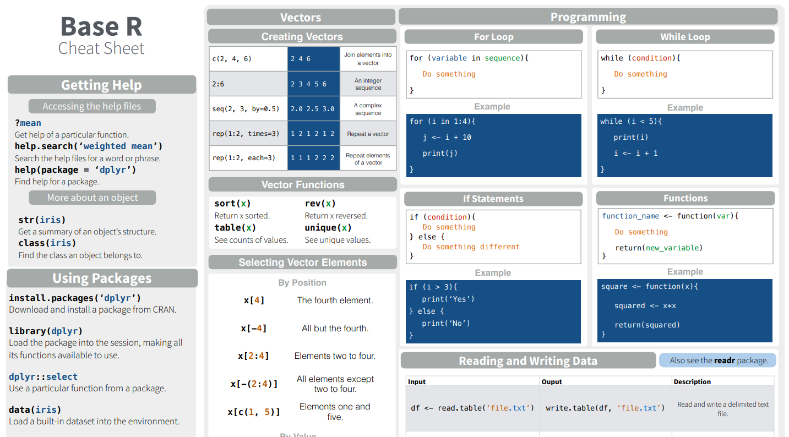

## Today's Agenda

--

- (finish) Basic statistics and graphs

--

- Chi-square tests

--

- Sample size and power


```{r setup, include=FALSE}
knitr::opts_chunk$set(comment = ">",
                      cache = TRUE,
                      cache.path = "./cache/")
options(htmltools.dir.version = FALSE,
        dplyr.width = 60,
        dplyr.print_min = 5,
        dplyr.print_max = 5)
```

---
## Useful functions

Generating random numbers

```{r, fig.width=7, fig.height=4, fig.align='center'}
x <- rnorm(100, mean = 2, sd = 1)
x[1:5]

hist(x)
```

---
## Asking for help()

- If you want more info about a specific function, e.g. `seq()`, you can do

```r
help(seq)
```

same as 
```r
?seq
```

- In RStudio, press F1 with your cursor is on top of the function name

- If you don't know if there is a function to perform an specific task (most likely there is), you can try searching the R function catalog with <br/> `??<search term>`

- Easier to just Google it. All official (and unofficial) R documentation is available online

---
## RStudio cheat sheets

The RStudio company created a series of quick access guides to help people familiarize themselves with broad R capabilities

https://rstudio.com/resources/cheatsheets/

.center[]

---
## Resources for learning R

- RStudio publishes a lot of R/RStudio free resources

  - RStudio Webnar Series
  https://resources.rstudio.com/webinars

--

  - RStudio publications (free ebooks and tutorials)
  
.center[]

--

  - Literally, all over the internet. Just be careful with your Stats methods sources. There is a lot of junk statistics written online

---
class:middle

## Final comment about R

- It's a language in constant and rapid evolution.

- I constantly "Google" stuff that I know how to do just to see if a new technique shows up

---
class: middle, center
## Part II
## Descriptive Analysis

---
## Quantitative and qualitative data

- Quantitative data (continuous, counts) can be stored as **numeric**

- Qualitative data (nominal or ordinal) can be stored as **factors**

```{r}
gender <- rep(c("F", "M"), times = 3:2)
gender
gender <- as.factor(gender)
gender
```

- Creating categorical variable from continuous data
```{r}
age <- rnorm(100, 25, 2)
age_cat <- cut(age, breaks = c(0, 10, 25, 99))
age_cat[1:5]
```

---
## Measures of location

```{r}
x <- sample.int(5, 30, replace = T)
x[1:5]
mean(x)
median(x)
quantile(x, probs = c(.25, .5, .75))
```

---
## Measures of location

```{r}
table(x)
prop.table(table(x))
```

- Finding the mode manually

```{r}
freq <- table(x)
freq[freq == max(freq)]
```


---
## Measures of spread and shape

```{r}
z <- rnorm(100, mean = 10, sd = 2)
var(x)
sd(x)
range(x) # returns min/max values
max(x) - min(x)
IQR(x)
quantile(x, .75) - quantile(x, .25)
```

---
## Measures of spread and shape

Let's compute Skewness and Kurtosis manually

```{r}
centered_moment <- function(x, r = 2) {
  n <- length(x)
  m <- mean(x)
  return(sum((x - m)^r/n))
}

m2 <- centered_moment(z, 2)
m3 <- centered_moment(z, 3)
m4 <- centered_moment(z, 4)

# Skewness
m3/(m2^1.5)

# Kurtosis
m4/(m2^2)
```

---
## Frequency table

```{r}
head(mtcars)
freq <- table(mtcars$gear)
prop.table(freq)
```

---
## Contingency table

```{r}
freq <- table(mtcars$vs, mtcars$am)
freq
```

--

```{r}
freq <- xtabs(~ vs + am, data = mtcars)
freq
```

- **xtabs()** is useful when you already have collapsed data
---
## Histogram

```{r, fig.width=8, fig.height=6, fig.align='center'}
hist(mtcars$mpg, main = "Histogram of mpg",
     xlab = " Miles/(US) gallon")
```

---
## Histogram

```{r, fig.width=8, fig.height=6, fig.align='center'}
hist(mtcars$mpg, freq = FALSE)
```

---
## Box-plot

```{r, fig.width=8, fig.height=6, fig.align='center'}
boxplot(mtcars$mpg)
```

---
## Box-plot

```{r, fig.width=8, fig.height=6, fig.align='center'}
boxplot(mpg ~ cyl, data = mtcars,
        ylab = "Miles per gallon",
        xlab = "Number of cylinders")
```

---
## Scatterplot

```{r, fig.width=8, fig.height=6, fig.align='center'}
plot(x = mtcars$wt, y = mtcars$hp,
     pch = 20, col = 2, las = 1, cex=2)
```

---
## Barplot

```{r, fig.width=8, fig.height=6, fig.align='center'}
dt <- rbind(c(122, 167, 528, 673),
            c(203, 118, 178, 212))

barplot(dt, main = "Survival of Each Class",
        xlab = "Class", col = c("red","green"))
```

---
## Barplot

```{r, fig.width=8, fig.height=6, fig.align='center'}
barplot(dt, main = "Survival of Each Class",
        xlab = "Class", col = c("red","green"),
        beside = TRUE)
legend("topleft", c("Not survived","Survived"),
       fill = c("red","green"))
```

---
## (basic) Chi-squared tests

From yesterday's lecture

```{r}
M <- rbind(c(4, 7),
           c(21, 8))
M
dimnames(M) <- list(exercise = c("yes", "no"),
                    obesity = c("yes", "no"))
M
```


---
## (basic) Chi-squared tests

```{r}
chisq.test(M)

Xsq <- chisq.test(M)
Xsq
```

---
## (basic) Chi-squared tests

```{r}
Xsq$observed   # observed counts (same as M)
Xsq$expected   # expected counts under the null
```

---
## (basic) Chi-squared tests

```{r}
fisher.test(M)
```

---
## (basic) Chi-squared tests

Case-control study (exercise)

```{r}
M <- rbind(c(60, 100),
           c(40, 300))
dimnames(M) <- list(smoker = c("yes", "no"),
                    group = c("case", "control"))
M
t(M)
```

---
## (basic) Chi-squared tests

Case-control study

```{r}
chisq.test(M)
chisq.test(t(M))
```

---
## (basic) Chi-squared tests

Trend test

```{r}
prop.trend.test(x = c(1,5,5,14),
                n = c(47,69,44,90))
```

---
## (basic) Chi-squared tests

McNemar's Test

Agresti (1990), p. 350.
Presidential Approval Ratings.

Approval of the President's performance in office in two surveys,
one month apart, for a random sample of 1600 voting-age Americans.

```{r}
Performance <- matrix(c(794, 86, 150, 570), nrow = 2,
                      dimnames = list(
                        "1st Survey" = c("Approve", "Disapprove"),
                        "2nd Survey" = c("Approve","Disapprove")))
Performance
```

---
## (basic) Chi-squared tests

McNemar's Test

Agresti (1990), p. 350.
Presidential Approval Ratings.

Approval of the President's performance in office in two surveys,
one month apart, for a random sample of 1600 voting-age Americans.

```{r}
mcnemar.test(Performance)
```

---
## Kappa statistic

- EXAMPLE 1:

Kidney samples from 291 salmon were split with one half of the 
samples sent to each of two laboratories where an IFAT test
was run on each sample. The following results were obtained:

  - Lab 1 positive, lab 2 positive: 19
  - Lab 1 positive, lab 2 negative: 10
  - Lab 1 negative, lab 2 positive: 6
  - Lab 1 negative, lab 2 negative: 256

---
## Kappa statistic

```{r}
library(epiR)

dat <- as.table(matrix(c(19,10,6,256), nrow = 2, byrow = TRUE))
colnames(dat) <- c("L1-pos","L1-neg")
rownames(dat) <- c("L2-pos","L2-neg")
dat
```

---
```{r}
epi.kappa(dat, method = "fleiss", alternative = "greater", conf.level = 0.95)
```

---
## Kappa statistic

The z test statistic is 11.53 (P < 0.01).

We accept the alternative hypothesis that the kappa statistic is greater than zero.

The proportion of agreements after chance has been excluded is 0.67 (95% CI 0.56 to 0.79).

We conclude that, on the basis of this sample, that there is substantial agreement between the two laboratories.

---
## Sample size and Power
### Continuous outcomes in SRS

Woodward M (2005). Epidemiology Study Design and Data Analysis. Chapman & Hall/CRC, New York, pp. 381 - 426.

(from Woodward 2005 p. 399): supposed we wish to test, at the 5% level of significance, the hypothesis that cholesterol means in a population are equal in two study years against the one-sided alternative that the mean is higher in the second of the two years. Suppose that equal sized samples will be taken in each year, but that these will not necessarily be from the same individuals (i.e. the two samples are drawn independently). Our test is to have a power of 0.95 at detecting a difference of 0.5 mmol/L. The standard deviation of serum cholesterol in humans is assumed to be 1.4 mmol/L.

---
## Sample size/Power - Continuous outcomes in SRS

```{r}
epi.sscompc(treat = 5, control = 4.5, n = NA, sigma = 1.4,
            power = 0.90, r = 1, design = 1, sided.test = 1,
            conf.level = 0.95)
```

**Conclusion:** to satisfy the study requirements 270 individuals need to be tested: 135 in the first year and 135 in the second year.

---
## Sample size/Power - Continuous outcomes in SRS

```{r}
epi.sscompc(treat = 5, control = 4.5, n = 300, sigma = 1.4,
            power = NA, r = 1, design = 1, sided.test = 2,
            conf.level = 0.95)
```

---
## Sample size/Power - Binary outcomes in SRS

(from Woodward 2005 pp. 403 - 404):

A government initiative has decided to reduce the prevalence of male smoking to, at most, 30%. A sample survey is planned to test, at the 0.05 level, the hypothesis that the percentage of smokers in the male population is 30% against the one-sided alternative that it is greater.

The survey should be able to find a prevalence of 32%, when it is true, with 0.90 power. How many men need to be sampled?

---
## Sample size/Power - Binary outcomes in SRS

```{r}
epi.sscompb(treat = 0.30, control = 0.32, n = NA, power = 0.90,
            r = 1, design = 1, sided.test = 1, conf.level = 0.95)
```

A total of 18,316 men should be sampled: 9158 in the treatment group and 
9158 in the control group. The risk ratio (that is, the prevalence of smoking in males post government initiative divided by the prevalence of smoking in males pre inititative is 0.94.

---
## Sample size/Power - OR in CC

(from Woodward 2005 p. 412):

A case-control study of the relationship between smoking and CHD is planned. A sample of men with newly diagnosed CHD will be compared for smoking status with a sample of controls. Assuming an equal number of cases and controls, how many study subject are required to detect anodds ratio of 2.0 with 0.90 power using a two-sided 0.05 test? Previous surveys have shown that around 0.30 of males without CHD are smokers.

---
## Sample size/Power - OR in CC

```{r}
epi.sscc(OR = 2.0, p0 = 0.30, n = NA, power = 0.90, r = 1,
         sided.test = 2, conf.level = 0.95)
```

A total of 376 men need to be sampled: 188 cases and 188 controls.


