```{r setup, include=FALSE}
knitr::opts_chunk$set(comment = ">",
                      cache = TRUE,
                      cache.path = "./cache/")
options(htmltools.dir.version = FALSE,
        dplyr.width = 60,
        dplyr.print_min = 5,
        dplyr.print_max = 5)

library(tidyverse)
library(readxl)
```

class: center, middle, inverse
# Part I-a
# R Packages and working with <br/> external data


---
## R packages

- power of R is on its packages

.center[]

- Think of a task and there is probably a package that can help you do it.

- All packages are open-source

- Some packages are better then others (check for updates and quality of its documentation)

- Easy to install packages via RStudio

---
## Importing external data - txt

.left-column[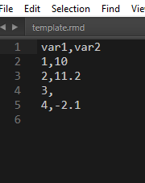]
.right-column[
```{r}
read.table(file = "./data/dummy_data.csv",
           header = T, sep = ",")
```

--

```{r}
read.csv(file = "./data/dummy_data.csv")
```
]

---
## Importing external data - excel

- Requires external packages: e.g. **readxl**

```
install.packages("readxl")
library(readxl)
```
.left-column[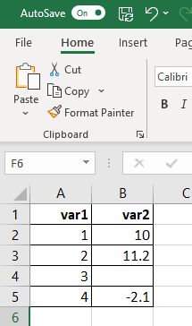]
.right-column[

```{r}
read_xlsx(path = "./data/dummy_data.xlsx")
```
]

---
## Importing external data - spss/sas/stata

- Requires package **haven**

```
library(haven)

data_sas <- read_sas("dados/datafile.sas7bdat")
data_spss <- read_spss("dados/datafile.sav")
```

--

## Importing external data - from the internet

- For a URL that has the data file, just use the file address

```
read.csv("https://mywebsite.com/iris.csv")
```

- Web scrapping can be done using packages like **rvest**, **rjason**, **jsonlite**

---
## Importing external data using RStudio

- Can also be done via RStudio's File menu

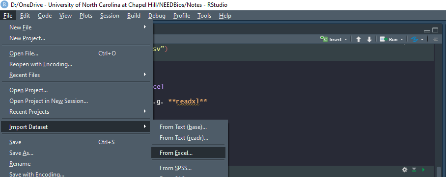

---
## Checking the data

- From **base R**

```{r}
h1n1 <- read.csv("./data/h1n1_usa.csv")
head(h1n1)
```

--

- From the **tidyverse** package

```{r}
glimpse(h1n1)
```

---
## Checking the data

- Can also inspect the dataset using RStudio's Environment tab

- Or do **`View(h1n1)`**

--

- Try the **`summary()`** function from base R

```{r}
summary(h1n1)
```

--

### Exporting data

- As CSV with **`write.csv()`**
- As an R object with **`write.rds()`**

---
class: center, middle, inverse
# Part I-b
# Introduction to <br/> tidyverse

---
## R before/after Hadley Wickham

.left-column[]

.right-column[
- Hadley Wickham, Chief Scientist at RStudio and an adjunct Professor of statistics at the University of Auckland, Stanford University, and Rice University.

--

- _tidyverse_: collection of R packages for data science that share a common philosophy
]

.center[]

---
## Pipe operator %>%

- Allow you to write more readable code

```{r}
x <- c(1, 2, 3, 4)
sqrt(sum(x))

x %>% sum() %>% sqrt()
```

- Like a recipe

```
let_cool(bake(put(mix(add(bowl(rep("flour", 2), "water", "baking_soda",
  "milk", "oil"), "flour", until = "soft"), duration = "3min"),
  where = "pan", type = "pan", grease = TRUE), duration = "50min"),
  "fridge", "20min")

bowl(rep("flour", 2), "water", "baking_soda", "milk", "oil") %>%
  add("farinha", until = "soft") %>%
  mix(duration = "3min") %>%
  put(where = "pan", type = "pan", grease = TRUE) %>%
  bake(duration = "50min") %>%
  let_cool("fridge", "20min")
```

---
## tibbles (tidy tables)

- From the **tibble** package (included in the **tidyverse** package)

```{r}
h1n1 <- as_tibble(h1n1)
h1n1
```

---
## Shaping data with dplyr

- Main functions:

--

  - **`filter()`** - filter lines

--

  - **`select()`** - select columns

--

  - **`arrange()`** - sort dataset

--

  - **`mutate()`** - create/modify columns

--

  - **`group_by()`** - group base

--

  - **`summarise()`** - summaris(z)e data

---
## Line filtering

```{r}
h1n1 %>% 
  filter(Deaths > 10)
```

```{r}
h1n1 %>% 
  filter(Deaths > 10, Population <= 1e7)
```

---
## Line filtering

```{r}
h1n1 %>% 
  filter(Deaths > 10 & Population <= 1e7)
```

```{r}
h1n1 %>% 
  filter(Deaths > 10 | Cases >= 1000)
```

---
## Line filtering

```{r}
h1n1 %>% 
  filter(State %in% c("New York", "North Carolina"))
```

--

- String manipulation using the **`stringr`** package (also tidyverse)

```{r}
h1n1 %>% 
  filter(str_detect(State, "A"))
```

---
## Selecting columns

- Infertility after Spontaneous and Induced Abortion (case-control)

```{r}
library(datasets)
infert <- as_tibble(infert)
infert
```

---
## Selecting columns

```{r}
infert %>% select(age, case)
```

```{r}
infert %>% select(education:case)
```

---
## Selecting columns

```{r}
infert %>% select(contains("stratum"))
```

```{r}
infert %>% select(-education, -age)
```

---
## Sorting dataset

```{r}
infert %>% arrange(age)
```

```{r}
infert %>% arrange(spontaneous, desc(age))
```

---
## Creating new variables

```{r}
h1n1 <- h1n1 %>%
  mutate(Population = round(Population/1000, 0))
print(h1n1, n = 10)
```

---
## Creating new variables

```{r}
h1n1 %>%
  mutate(Rate = Deaths/Cases) %>% 
  print(n = 10)
```

---
## Creating new variables

```{r}
h1n1 %>%
  mutate(aux = paste0(round(Deaths/Cases*100, 1), "%"),
         Rate = ifelse(Deaths == 0, "No deaths", aux)) %>% 
  print(n = 10)
```

---
## Creating new variables

```{r}
h1n1 <- h1n1 %>%
  mutate(id = row_number()) %>% 
  unite(col = "state_id", id, State, sep = "_")
h1n1 %>% print(n = 10)
```

---
## Creating new variables

```{r}
h1n1 <- h1n1 %>%
  separate(col = state_id, into = c("id", "State"), sep = "_")
h1n1 %>% print(n = 10)
```

---
## Grouping and summarizing

```{r}
infert %>% 
  summarise(mean_age = mean(age, na.rm = TRUE))
```

--

```{r}
infert %>% 
  summarise(mean_age = mean(age, na.rm = TRUE),
            median_age = median(age, na.rm = TRUE),
            n = n(),
            nmiss = sum(is.na(age)))
```

---
## Grouping and summarizing

```{r}
infert %>% 
  group_by(case) %>% 
  summarise(mean_age = mean(age, na.rm = TRUE),
            median_age = median(age, na.rm = TRUE),
            n = n(),
            nmiss = sum(is.na(age)))
```

---
## Grouping and summarizing

```{r}
infert %>% 
  group_by(case, induced) %>% 
  summarise(mean_age = mean(age, na.rm = TRUE),
            median_age = median(age, na.rm = TRUE),
            n = n(),
            nmiss = sum(is.na(age))) %>% 
  print(n = 10)
```

---
## Merging datasets

- Family of **`_join()`** functions

  - `left_join(x, y)`: returns ALL lines from `x` and ALL columns of `x` and `y`. Lines on `x` that does not have a correspondence in `y` will receive `NA` on the new dataset

--

  .center[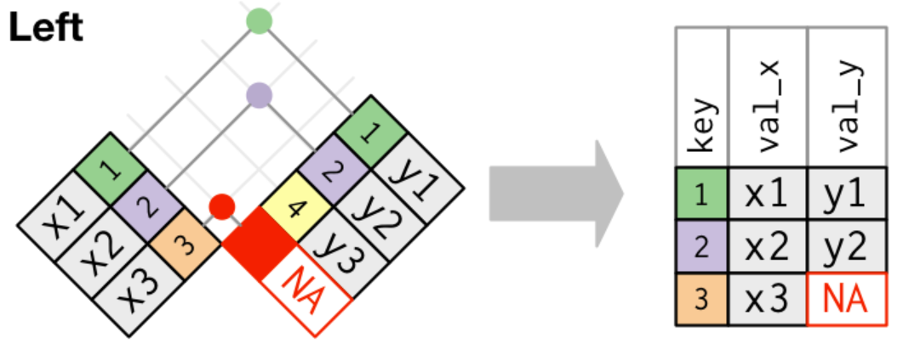]

---
## Merging datasets

  - `right_join(x, y)`: returns ALL lines from `y` and ALL columns of `y` and `x`. Lines on `y` that does not have a correspondence in `x` will receive `NA` on the new dataset

--

  .center[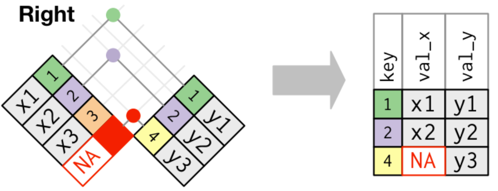]

---
## Merging datasets

  - `full_join(x, y)`: returns ALL lines and ALL columns of `y` and `x`. Lines without correspondence will receive `NA` on the new dataset

--

  .center[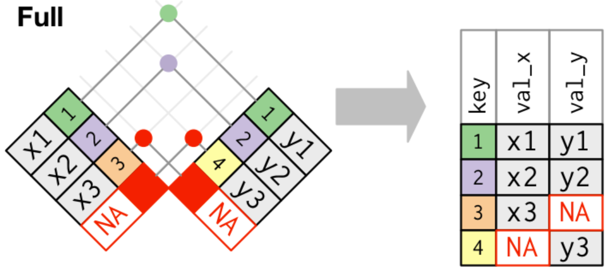]

---
## Merging datasets

- `by = <key_variable>`: used to match cases

- In case we have duplicated keys, this will happen

--

  .center[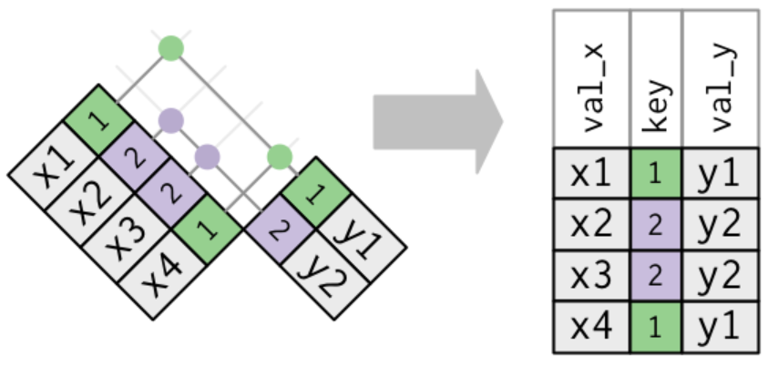]

- Same if there are duplicated on the "look-up" table

---
## Merging datasets

```{r}
x <- data.frame(id=c(1, 2, 3), vx=c("x1", "x2", "x3"))
y <- data.frame(id=c(1, 2), vy=c("y1", "y2"))
x; y
left_join(x, y, by = "id")
```

---
## Merging datasets

```{r}
x <- data.frame(id=c(1, 2, 2, 1), vx=c("x1", "x2", "x3", "x4"))
y <- data.frame(id=c(1, 2, 2), vy=c("y1", "y2", "y2"))
x; y
left_join(x, y, by = "id")
```

---
## Reshaping data wide/long

- Usually necessary when measuring individuals multiple times or over time on the same variable

--

- **`wide`** - one line per person

.center[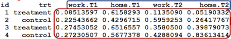]

--

- **`long`** - multiple lines per person

.center[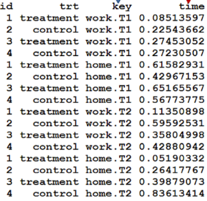]

---
## Reshaping data wide/long

### Wide to long: gather()

.center[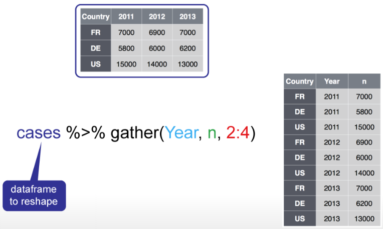]

---
## Reshaping data wide/long

### Wide to long: gather()

.center[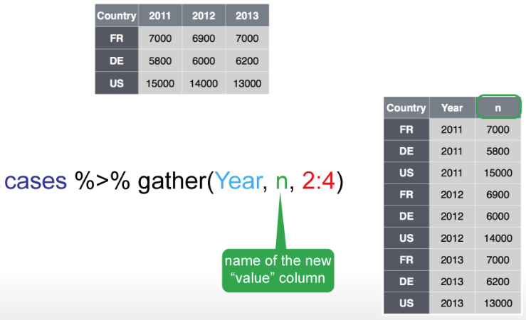]

---
## Reshaping data wide/long

### Wide to long: gather()

.center[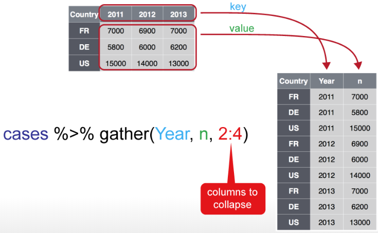]

---
## Reshaping data wide/long

### Wide to long: spread()

.center[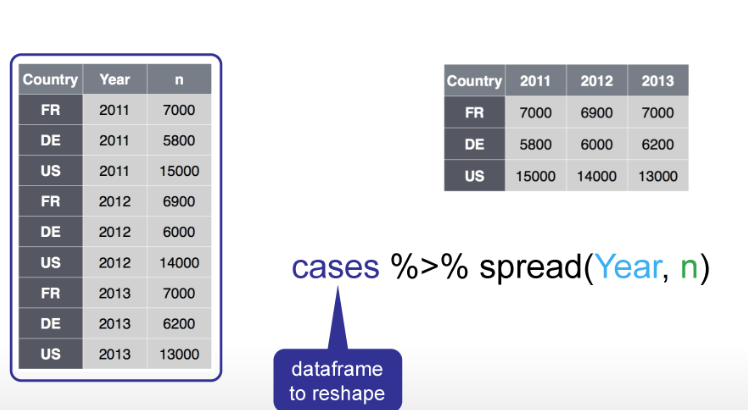]

---
## Reshaping data wide/long

### Wide to long: spread()

.center[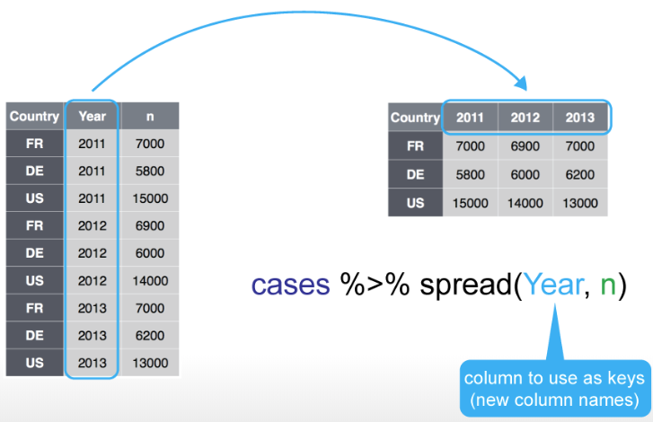]

---
## Reshaping data wide/long

### Wide to long: spread()

.center[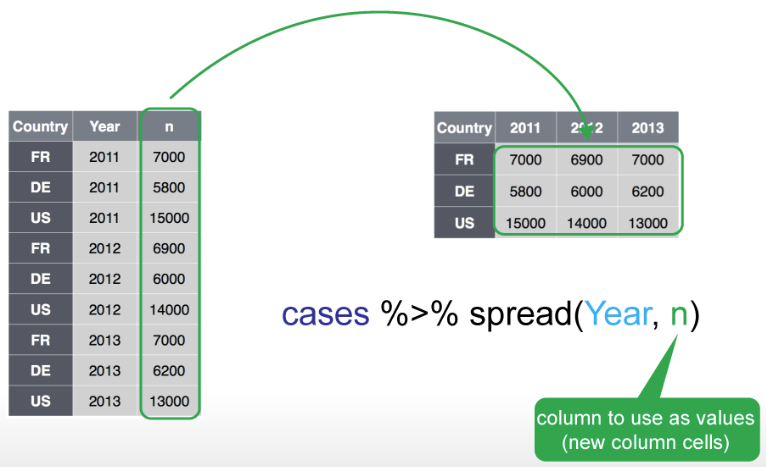]


