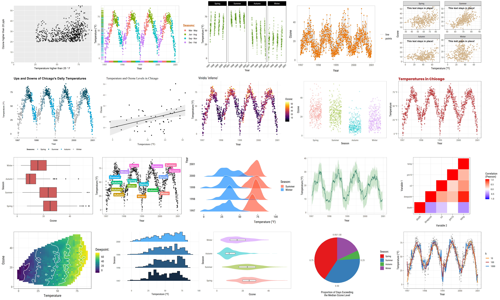

```{r setup, include=FALSE}
knitr::opts_chunk$set(comment = ">",
                      cache = TRUE,
                      cache.path = "./cache/")
options(htmltools.dir.version = FALSE,
        dplyr.width = 60,
        dplyr.print_min = 5,
        dplyr.print_max = 5)

library(tidyverse)
library(readxl)
library(ggplot2)
```

class: center, middle, inverse
# Part I
# Visualization with GGplot

---
## ggplot2

```
install.packages(ggplot2)
library(ggplot2)
```

.center[]

???

- gráficos naturalmente mais bonitos;
- muito mais fácil deixar o gráfico do jeito que você quer;
- a estrutura padronizada das funções deixa o aprendizado muito mais intuitivo; e
- bé possível criar uma imensa gama de gráficos com poucas linhas de código.

---
## Create your plot in layers

```{r, fig.width=7, fig.height=5, fig.align='center'}
imdb <- readRDS("./data/imdb.rds")
ggplot(data = imdb)
```

---
## Create your plot in layers

```{r, fig.width=7, fig.height=5, fig.align='center'}
ggplot(imdb) +
  geom_point(aes(x = budget, y = profit))
```

---
## Create your plot in layers

```{r, fig.width=7, fig.height=5, fig.align='center'}
ggplot(imdb) +
  geom_point(mapping = aes(x = budget, y = profit)) +
  geom_abline(intercept = 0, slope = 1, color = "red")
```

---
## dplyr + ggplot2

```{r, fig.width=7, fig.height=5, fig.align='center'}
imdb %>%
   mutate(net_profit = profit - budget,
          net_profit = ifelse(net_profit <= 0, "No", "Yes")) %>% 
  filter(!is.na(net_profit)) %>% 
  ggplot() + 
  geom_point(mapping = aes(x = budget, y = profit,
                           color = net_profit))
```

---
## dplyr + ggplot2

```{r, fig.width=7, fig.height=4, fig.align='center'}
imdb %>%
   mutate(net_profit = profit - budget,
          net_profit = ifelse(net_profit <= 0, "No", "Yes")) %>% 
  filter(!is.na(net_profit)) %>% 
  ggplot() + 
  geom_point(mapping = aes(x = budget, y = profit, color = net_profit)) + 
  labs(x = "Budget", y = "Gross income", color = "Profit?") 
```

---
## Aesthetics

```{r, fig.width=7, fig.height=5, fig.align='center'}
ggplot(imdb) +
  geom_point(aes(x = budget, y = profit, color = "blue"))
```

---
## Aesthetics

```{r, fig.width=7, fig.height=5, fig.align='center'}
ggplot(imdb) +
  geom_point(aes(x = budget, y = profit), color = "blue")
```

---
## Histogram

```{r, fig.width=7, fig.height=5, fig.align='center'}
ggplot(imdb) + 
  geom_histogram(aes(x = budget),
                 color = "black", fill = "white")
```

---
## Boxplot

```{r, fig.width=7, fig.height=5, fig.align='center'}
imdb %>% 
  filter(director %in% c("Steven Spielberg",
                         "Quentin Tarantino",
                         "Woody Allen")) %>%
  ggplot() +
  geom_boxplot(aes(x = director, y = budget))
```

---
## Barplot

```{r, fig.width=7, fig.height=5, fig.align='center'}
imdb %>% 
  filter(year > 1990) %>% 
  ggplot() +
  geom_bar(aes(x = year), color = "black", fill = "lightblue")
```

---
## Barplot

```{r, fig.width=7, fig.height=5, fig.align='center'}
imdb %>% 
  count(director) %>% # creates a column named 'n'
  filter(!is.na(director)) %>% 
  top_n(5, n) %>%
  ggplot() +
  geom_bar(aes(x = director, y = n),
           stat = "identity", color = "red", fill = "pink")
```

---
## Building-up layers

```{r, fig.width=7, fig.height=5, fig.align='center'}
ggplot(imdb, aes(x = budget, y = profit)) +
  geom_point() +
  geom_smooth(se = TRUE, method = "loess")
```

---
## Building-up layers

```{r, fig.width=7, fig.height=5, fig.align='center'}
ggplot(imdb, aes(x = budget, y = profit)) +
  geom_point(aes(color = year), alpha = .5) +
  geom_smooth(se = TRUE, method = "loess")
```

---
## Facets

```{r, fig.width=7, fig.height=5, fig.align='center'}
imdb %>%
  filter(classification %in% c("All ages", "14 or older")) %>%
  ggplot() +
  geom_point(aes(x = budget, y = score)) +
  facet_wrap(~ classification, nrow = 2)
```

---
## Facets

```{r, fig.width=7, fig.height=5, fig.align='center'}
imdb %>%
  filter(classification %in% c("All ages", "14 or older")) %>%
  ggplot() +
  geom_point(aes(x = budget, y = score)) +
  facet_wrap(~ classification, ncol = 2)
```

---
## Customization

```{r, fig.width=8, fig.height=5, fig.align='center'}
imdb %>% 
  filter(director %in% c("Steven Spielberg", "Quentin Tarantino", "Woody Allen")) %>%
  ggplot() +
  geom_boxplot(aes(x = director, y = budget, fill = director))
```

---
## Customization - no legend

```{r, fig.width=8, fig.height=5, fig.align='center'}
p <- imdb %>% 
  filter(director %in% c("Steven Spielberg",
                         "Quentin Tarantino",
                         "Woody Allen")) %>%
  ggplot() +
  geom_boxplot(aes(x = director, y = budget, fill = director),
               show.legend = FALSE)
```

---
## Customization - no legend

```{r, fig.width=8, fig.height=5, fig.align='center'}
p
```

---
## Customization - scale

```{r, fig.width=8, fig.height=5, fig.align='center'}
p +
  scale_y_continuous(labels = scales::dollar)
```

---
## Customization - changing the order

```{r, fig.width=8, fig.height=5, fig.align='center'}
p +
  scale_y_continuous(labels = scales::dollar) +
  scale_x_discrete(limits = c("Woody Allen", "Quentin Tarantino", "Steven Spielberg"))
```

---
## Customization - colors

```{r, fig.width=8, fig.height=5, fig.align='center'}
p +
  scale_y_continuous(labels = scales::dollar) +
  scale_x_discrete(limits = c("Woody Allen", "Quentin Tarantino", "Steven Spielberg")) +
  scale_fill_manual(values = c("#999999", "#E69F00", "#56B4E9"))
```

---
## Customization - legend position

```{r, fig.width=8, fig.height=5, fig.align='center'}
imdb %>% 
  filter(director %in% c("Steven Spielberg", "Quentin Tarantino", "Woody Allen")) %>%
  ggplot() +
  geom_boxplot(aes(x = director, y = budget, fill = director)) + 
  theme(legend.position = "bottom")
```

---
## Customization - legend position

```{r, fig.width=8, fig.height=4, fig.align='center'}
imdb %>% 
  filter(director %in% c("Steven Spielberg", "Quentin Tarantino", "Woody Allen")) %>%
  ggplot() +
  geom_boxplot(aes(x = director, y = budget, fill = director)) + 
  theme_minimal() +
  theme(legend.position = "bottom") +
  ggtitle("My boxplot")
```

---
class: center, middle, inverse
# Part II
# Confidence intervals and <br/> hypothesis testing


