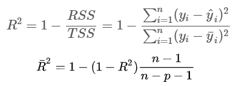

```{r setup, include=FALSE}
knitr::opts_chunk$set(comment = ">",
                      cache = TRUE,
                      cache.path = "./cache/")
options(htmltools.dir.version = FALSE,
        dplyr.width = 60,
        dplyr.print_min = 5,
        dplyr.print_max = 5)

library(tidyverse)
library(ggplot2)

library(modelr)     # provides easy pipeline modeling functions
library(broom)      # helps to tidy up model outputs
```

class: center, middle, inverse
# Part I
# Linear models

---
## Data

.center[]

---
## Data

```{r}
advertising <- read.csv("./data/Advertising.csv")[,-1]
head(advertising)
```

Data contains, in thousands of dollars, TV, Radio, and Newspaper budgets for 200 different markets along with the Sales, in thousands of units, for each market.

```{r}
set.seed(123)
sample <- sample(c(TRUE, FALSE), nrow(advertising),
                 replace = T, prob = c(0.6,0.4))
train <- advertising[sample,]
test <- advertising[!sample,]
```

---
## Data

```{r, fig.width=7, fig.height=5, fig.align='center'}
ggplot(train, aes(x = TV, y = sales)) +
  geom_point() +
  geom_smooth(se = FALSE, method = "loess")
```

---
## Initial model

```{r}
model1 <- lm(sales ~ TV, data = train)
summary(model1)
```

---
## Initial model

```{r}
library(broom)
```

```{r}
glance(model1)
```

--
 
## Accessing coefficients

```{r}
broom::tidy(model1)
```

---
## Accessing coefficients

```{r}
coef(model1)
confint(model1)
```

---
## Coefficient of determination

.center[]

- $R^2$ does not indicate whether:
  - the independent variables are a cause of the changes in the dependent variable
  - omitted-variable bias exists
  - the correct regression was used
  - the most appropriate set of independent variables has been chosen
  - there is collinearity present in the data on the explanatory variables
  - the model might be improved by using transformed versions of the existing set of independent variables
  - there are enough data points to make a solid conclusion

---
## Accessing model fit

```{r, fig.width=7, fig.height=5, fig.align='center'}
ggplot(train, aes(x = TV, y = sales)) +
  geom_point() +
  geom_smooth(se = FALSE, method = "loess") +
  geom_smooth(se = FALSE, method = "lm", color = "red")
```


---
## Accessing model fit

```{r, fig.width=7, fig.height=5, fig.align='center'}
ggplot(train, aes(x = TV, y = sales)) +
  geom_point() +
  geom_smooth(se = FALSE, method = "loess") +
  geom_smooth(se = FALSE, method = "lm", color = "red")
```

---
## Accessing model fit

```{r, warning=F, message=F, fig.width=9, fig.height=5, fig.align='center'}
# add model diagnostics to our training data
model1_results <- augment(model1, train)

ggplot(model1_results, aes(.fitted, .std.resid)) +
  geom_hline(yintercept = 0) +
  geom_point() + geom_smooth(se = FALSE) +
  theme_bw(base_size = 20)
```

---
## Accessing model fit

```{r, message=F, fig.width=9, fig.height=5, fig.align='center'}
ggplot(model1_results, aes(sample = .resid)) + 
  stat_qq() + stat_qq_line() +
  theme_bw(base_size = 20)
```

---
## Accessing model fit

```{r, message=F, fig.width=9, fig.height=5, fig.align='center'}
ggplot(model1_results, aes(seq_along(.cooksd), .cooksd)) +
  geom_bar(stat = "identity", position = "identity") +
  theme_bw(base_size = 20)
```

???
Outliers (on the space of covariatesp)


---
## Accessing model fit

```{r, message=F, fig.width=9, fig.height=5, fig.align='center'}
ggplot(model1_results, aes(.hat, .std.resid)) +
  geom_point(aes(size = .cooksd), na.rm = TRUE)+
  theme_bw(base_size = 20)
```

???
Influential on the regression line

---
## Multiple regression

```{r}
model2 <- lm(sales ~ TV + radio + newspaper, data = train)
summary(model2)
```

---
## Multiple regression - with interaction

```{r}
model3 <- lm(sales ~ TV * radio, data = train)
summary(model3)
```

---
## Comparing models

```{r}
anova(model1, model2)
```

---
## Comparing models

```{r}
list(model1 = broom::glance(model1), 
     model2 = broom::glance(model2))
```

---
## Comparing models

```{r}
fit <- list(model1 = broom::glance(model1), 
     model2 = broom::glance(model2)) %>% 
  bind_rows()
select(fit, 1:5)
select(fit, 6:11)
```

---
## Comparing models

- $R^2$: Model 2’s $R^2=.92$ is substantially higher than model 1 suggesting that model 2 does a better job explaining the variance in sales

- **The adjusted** $R^2$ is a modified version of $R^2$ that has been adjusted for the number of predictors in the model. The adjusted $R^2$ increases only if the new term improves the model more than would be expected by chance

- **RSE:** Model 2’s RSE (`sigma`) is lower than model 1. This shows that model 2 reduces the residual variance

- **F-statistic:** (`statistic`) in model 2 is larger than model 1. Here larger is better and suggests that model 2 provides a better “goodness-of-fit”

- **Other:** We can also use other various statistics to compare the quality of our models. These include Akaike information criterion (AIC) and Bayesian information criterion (BIC). The lower AIC and BIC the better

---
## Comparing models

```
model1_results <- mutate(model1_results, model = "Model 1")

# Add resiuals analysis for model 2
model2_results <- augment(model2, train) %>%
  mutate(model = "Model 2") %>%
  rbind(model1_results)

# Add resiuals analysis for model 2
model3_results <- augment(model3, train) %>%
  mutate(model = "Model 3") %>%
  rbind(model2_results)

# Diagnostic plot
ggplot(model3_results, aes(.fitted, .std.resid)) +
  geom_hline(yintercept = 0) +
  geom_point() + geom_smooth(se = FALSE) +
  facet_wrap(~ model) +
  theme_bw(base_size = 20)
```

---
## Comparing models

```{r, echo=F, message=F, fig.width=9, fig.height=5, fig.align='center'}
model1_results <- mutate(model1_results, model = "Model 1")
model2_results <- augment(model2, train) %>%
  mutate(model = "Model 2") %>%
  rbind(model1_results)

model3_results <- augment(model3, train) %>%
  mutate(model = "Model 3") %>%
  rbind(model2_results)

ggplot(model3_results, aes(.fitted, .std.resid)) +
  geom_hline(yintercept = 0) +
  geom_point() + geom_smooth(se = FALSE) +
  facet_wrap(~ model) +
  theme_bw(base_size = 20)
```

---
## Making predictions

```{r}
# test MSE
test %>% 
  add_predictions(model1) %>% 
  head()

test %>%
  gather_predictions(model1, model2, model3) %>%
  group_by(model) %>%
  summarise(MSE = mean((sales - pred)^2))
```


---
## (multi)colinearity
```{r, echo=T, message=F, warning=F, fig.width=9, fig.height=5, fig.align='center'}
library(GGally)
ggpairs(train)
```

???
possible for collinear-ity to exist between three or more variables. aka multicollinearity.

---
## (multi)colinearity

$$VIF_j = \frac{\mathrm{var}(\hat{\beta}_j)_{full}}{\mathrm{var}(\hat{\beta}_j)_{x_j}} = \frac{1}{1-\hat{R}_j}$$

- VIFs exceeding 4 warrant further investigation
- VIFs exceeding 10 are signs of serious multicollinearity requiring correction.

```{r}
car::vif(model2)
DescTools::VIF(model2)
```

---


