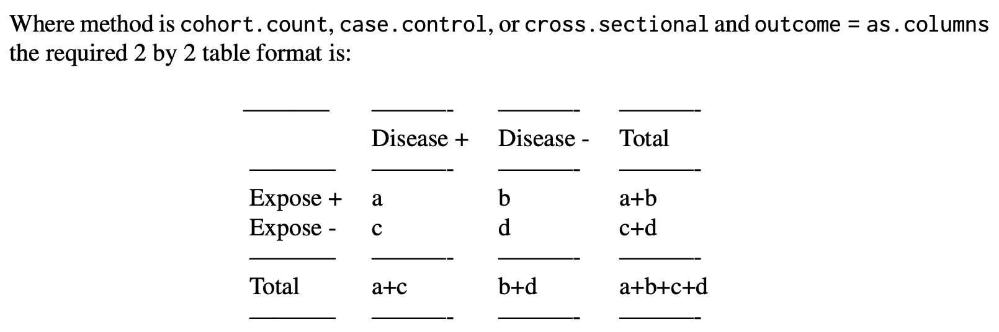

```{css}
.tiny .remark-code {
  font-size: 70% !important;
}
```

```{r setup, include=FALSE}
knitr::opts_chunk$set(comment = ">",
                      cache = FALSE,
                      cache.path = "./cache/")
options(htmltools.dir.version = FALSE,
        dplyr.width = 60,
        dplyr.print_min = 5,
        dplyr.print_max = 5)

library(tidyverse)
library(ggplot2)

library(modelr)     # provides easy pipeline modeling functions
library(broom)      # helps to tidy up model outputs
```

---
class: center, middle, inverse
# Part I
# Stratification in R

---
## Analysis of 2x2 tables

- **epiR** package: Tools for the Analysis of Epidemiological Data
 
  - Adjusted and unadjusted measures of disease frequency
  
  - Quantifying measures of association on single or multiple strata of count data
  
  - confidence intervals around incidence risk and incidence rate estimates
  
  - miscellaneous functions for use in meta-analysis
  
  - diagnostic test interpretation
  
  - sample size calculations

Other packages:

- Epi, epibasix, epiDisplay, epitools, ...

- The pubh package provides tries to provide a common syntax for the most frequent statistical analysis in epidemiology.

---
## Analysis of 2x2 tables

EXAMPLE 1: a cross sectional study investigating the relationship between dry cat food (DCF) and feline urologic syndrome (FUS) was conducted (Willeberg 1977). Counts of individuals in each group were as follows:

  - DCF-exposed cats (cases, non-cases) 13, 2163
  - Non DCF-exposed cats (cases, non-cases) 5, 3349

- Outcome variable (FUS) as columns

```{r}
dat <- matrix(c(13,2163,5,3349), nrow = 2, byrow = TRUE)
rownames(dat) <- c("DF+", "DF-")
colnames(dat) <- c("FUS+", "FUS-")
dat
```

---
## Analysis of 2x2 tables

```{r message=FALSE, warning=FALSE, include=FALSE}
library(epiR)
```

.tiny[
```{r}
epi.2by2(dat = as.table(dat), method = "cross.sectional",
         conf.level = 0.95, units = 100, outcome = "as.columns")
```
]

---
## Analysis of 2x2 tables

- **method** - a character string indicating the study design on which the tabular data has been
based. Options are `cohort.count`, `cohort.time`, `case.control`, or `cross.sectional`.

.center[]

---
## Analysis of 2x2 tables

- **method** - a character string indicating the study design on which the tabular data has been
based. Options are `cohort.count`, `cohort.time`, `case.control`, or `cross.sectional`.

.center[]

---
## Analysis of 2x2 tables

- attributable risk is the risk of disease in the exposed group minus the risk of disease in the unexposed group.

- attributable risk provides a measure of the absolute increase or decrease in risk associated with exposure.

- attributable fraction is the proportion of study outcomes in the exposed group that is attributable to exposure.

- population attributable risk is the risk of the study outcome in the population that may be attributed to exposure.

- population attributable fraction is the proportion of the study outcomes in the population that is attributable to exposure.

---
## Analysis of 2x2 tables

**Interpretations**

- Prevalence ratio:

The prevalence of FUS in DCF exposed cats is 4.01 (95% CI 1.43 to 11.23) times greater than the prevalence of FUS in non-DCF exposed cats.

- Attributable fraction in the exposed:

In DCF exposed cats, 75% of FUS is attributable to DCF (95% CI 30% to 91%).

- Attributable fraction in the population:

Fifty-four percent of FUS cases in the cat population are attributable to DCF (95% CI 4% to 78%).

---
## Analysis of 2x2 tables

EXAMPLE 2: This example shows how the table function can be used to pass data to epi.2by2. Here we use the birthwgt data from the MASS package.

Exposure (rows) = smoke. Outcome (columns) = low.

```{r}
dat1 <- MASS::birthwt
head(dat1)
```

---
## Analysis of 2x2 tables

Generate a table of cell frequencies. First set the levels of the outcome and the exposure so the frequencies in the 2 by 2 table come out in the conventional format:

```{r}
dat1$low <- factor(dat1$low, levels = c(1,0))
dat1$smoke <- factor(dat1$smoke, levels = c(1,0))
dat1$race <- factor(dat1$race, levels = c(1,2,3))
tab1 <- table(dat1$smoke, dat1$low, dnn = c("Smoke", "Low BW"))
tab1
```

---
## Analysis of 2x2 tables

Compute the incidence risk ratio and other measures of association:

.tiny[
```{r}
epi.2by2(dat = tab1, method = "cohort.count",
         conf.level = 0.95, units = 100, outcome = "as.columns")
```
]

---
## Analysis of 2x2 tables

Odds ratio:

The odds of having a low birth weight child for smokers is 2.02 (95% CI 1.08 to 3.78) times greater than the odds of having a low birth weight child for non-smokers.

Now stratify by race:

```{r}
tab2 <- table(dat1$smoke, dat1$low, dat1$race,
              dnn = c("Smoke", "Low BW", "Race"))
```
.tiny[
```{r}
tab2
```
]

---
## Analysis of 2x2 tables

Compute the crude odds ratio, the Mantel-Haenszel adjusted odds ratio and other measures of association:

.tiny[
```{r}
epi.2by2(dat = tab2, method = "cohort.count",
                 conf.level = 0.95, units = 100, outcome = "as.columns")
```
]

---
## Analysis of 2x2 tables

- The Mantel-Haenszel test of homogeneity of the strata odds ratios is not significant (chi square test statistic 2.8; df 2; p-value = 0.247).

- We accept the null hypothesis and conclude that the odds ratios for each strata of race are the same.

- After accounting for the confounding effect of race, the odds of having a low birth weight child for smokers is 3.09 (95% CI 1.49 to 6.39) times that of non-smokers.

---
class: center, middle, inverse
# Part II
# Confidence intervals and <br/> hypothesis testing

---
## Confidence Intervals

- **epi.conf** - confidence intervals for means, proportions, incidence, and standardised mortality ratios

EXAMPLE 1:

```{r}
dat <- rnorm(n = 100, mean = 0, sd = 1)
epi.conf(dat, ctype = "mean.single")
```

EXAMPLE 3:

```{r}
group <- c(rep("A", times = 5),
           rep("B", times = 5))
val = round(c(rnorm(n = 5, mean = 10, sd = 5),
              rnorm(n = 5, mean = 7, sd = 5)), digits = 0)
dat <- data.frame(group = group, val = val)
```

---
## Confidence Intervals

```{r}
dat
epi.conf(dat, ctype = "mean.unpaired")
```

---
## Confidence Intervals

EXAMPLE 4: Single sample (Altman et al. 2000, page 47): Out of 263 giving their views on the use of personal computers in general practice, 81 thought that the privacy of their medical file had been reduced.

```{r}
pos <- 81
neg <- (263 - 81)
dat <- as.matrix(cbind(pos, neg))
dat
round(epi.conf(dat, ctype = "prop.single"), digits = 3)
```

The 95% confidence interval for the population value of the proportion of patients thinking their privacy was reduced was from 0.255 to 0.366.

---
## Confidence Intervals

EXAMPLE 5: a herd of 1000 cattle were tested for brucellosis. Four samples out of 200 test returned a positive result. Assuming 100% test sensitivity and specificity, what is the estimated prevalence of brucellosis in this group of animals?

```{r}
pos <- 4; pop <- 200
dat <- as.matrix(cbind(pos, pop))
epi.conf(dat, ctype = "prevalence", method = "exact", N = 1000,
design = 1, conf.level = 0.95) * 100
```

The estimated prevalence of brucellosis in this herd is 2 cases ## per 100 cattle (95% CI 0.54 -- 5.0 cases per 100 cattle).

---
## Hypothesis testing - Normality

```{r}
## Annette Dobson (1990) "An Introduction to Generalized Linear Models".
## Page 9: Plant Weight Data.
ctl <- c(4.17,5.58,5.18,6.11,4.50,4.61,5.17,4.53,5.33,5.14)
trt <- c(4.81,4.17,4.41,3.59,5.87,3.83,6.03,4.89,4.32,4.69)
group <- gl(2, 10, 20, labels = c("Ctl","Trt"))
weight <- c(ctl, trt)
model <- lm(weight ~ group)

x = residuals(model)
```

---
## Hypothesis testing - t-test

```{r}
x = rnorm(100, mean = 1, sd = 1)
y = rnorm(100, mean = 1, sd = 2)
t.test(x)
```

---
## Hypothesis testing - t-test

```{r}
t.test(x, y)
```

---
## Hypothesis testing - t-test

```{r}
t.test(x, y, var.equal=TRUE)
```

---
## Hypothesis testing - t-test

```{r}
t.test(x, y, paired = TRUE)
```

---
## Hypothesis testing - Normality

- Shapiro–Wilk normality test

```{r}
shapiro.test(x)
```

---
## Hypothesis testing - Proportions

Data from Fleiss (1981), p. 139.

H0: The null hypothesis is that the four populations from which the patients were drawn have the same true proportion of smokers.

A:  The alternative is that this proportion is different in at least one of the populations.

```{r}
smokers  <- c(83, 90, 129, 70)
patients <- c(86, 93, 136, 82)
prop.test(smokers, patients)
```

---
## Hypothesis testing - Normality

- One-sample Kolmogorov-Smirnov test

```{r}
shapiro.test(x)
```

---
## Hypothesis testing - Homoskedasticity

- Bartlett’s test for homogeneity of variance

Bartlett’s test is known to be sensitive to non-normality in samples.  That is, non-normal samples can result in a significant test due to the non-normality.

```{r}
bartlett.test(weight ~ group)
```

---
## Hypothesis testing - Homoskedasticity

- Levene’s test for homogeneity of variance

Levene’s test is an alternative to Bartlett’s that is supposedly less sensitive to departures from normality in the data.

```{r}
car::leveneTest(weight ~ group)
```


