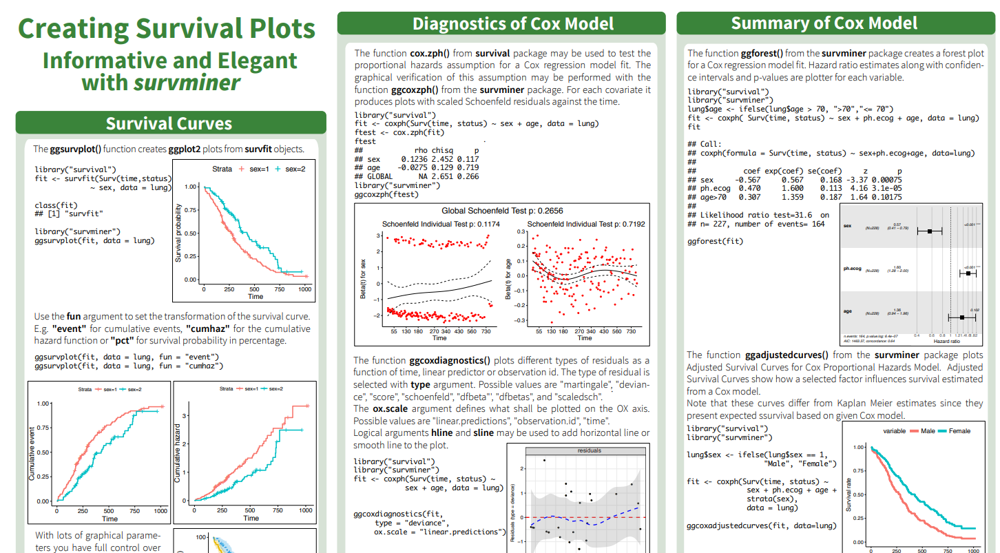

```{r setup, include=FALSE}
knitr::opts_chunk$set(comment = ">",
                      cache = TRUE,
                      cache.path = "./cache/")
options(htmltools.dir.version = FALSE,
        dplyr.width = 60,
        dplyr.print_min = 5,
        dplyr.print_max = 5)

library(tidyverse)
library(ggplot2)

library(survival)
library(survminer)
library(lubridate)
```

class: center, middle, inverse
# Part I
# Survival Analysis

---
## Packages

- `lubridate`
- `survival`
- `survminer`

## Data

The `lung` dataset is available from the `survival` package in `R`. The data contain subjects with advanced lung cancer from the North Central Cancer Treatment Group. 

- time:	Survival time in days
- status:	censoring status 1=censored, 2=dead
- sex: Male=1 Female=2

---
## Dealing with dates in R

- Data will often come with start and end dates rather than pre-calculated survival times. The first step is to make sure these are formatted as dates in R. 

```{r datedata}
date_ex <- 
  tibble(
    sx_date = c("2007-06-22", "2004-02-13", "2010-10-27"), 
    last_fup_date = c("2017-04-15", "2018-07-04", "2016-10-31")
    )
date_ex
```

---
## Formatting dates - base R

```{r format_date1}
date_ex %>% 
  mutate(
    sx_date = as.Date(sx_date,
                      format = "%Y-%m-%d"), 
    last_fup_date = as.Date(last_fup_date,
                            format = "%Y-%m-%d") 
    )
```

- In base `R` the format must include the separator as well as the symbol. e.g. if your date is in format m/d/Y then you would need `format = "%m/%d/%Y"`

---
## Formatting dates - lubridate package

We can also use the `lubridate` package to format dates. In this case, use the `ymd` function

```{r format_date2, message = FALSE}
date_ex %>% 
  mutate(
    sx_date = ymd(sx_date), 
    last_fup_date = ymd(last_fup_date)
    )
```

---
## Calculating survival times - base R

Use `difftime` to calculate the number of days between our two dates and convert it to a numeric value using `as.numeric`. Then convert to years by dividing by `365.25`, the average number of days in a year.

```{r format_for_real, echo = FALSE}
# First need to actually format the dates in the date_ex dataset
date_ex <- 
  date_ex %>% 
  mutate(last_fup_date = ymd(last_fup_date), 
         sx_date = ymd(sx_date))
```

```{r difftime_ex1}
date_ex %>% 
  mutate(
    os_yrs = 
      as.numeric(
        difftime(last_fup_date, 
                 sx_date, 
                 units = "days")) / 365.25
    )
```

---
## Calculating survival times - lubridate

the operator `%--%` designates a time interval, which is then converted to the number of elapsed seconds using `as.duration` and finally converted to years by dividing by `dyears(1)`, which gives the number of seconds in a year.

```{r difftime_ex2, message = FALSE, warning = FALSE}
date_ex %>% 
  mutate(
    os_yrs = 
      as.duration(sx_date %--% last_fup_date) / dyears(1)
    )
```

---
## Kaplan-Meier curves

**`survfit()`** function

```{r}
f1 <- survfit(Surv(time, status) ~ 1, data = lung)
f1
```

---
## Kaplan-Meier curves

```{r}
str(f1)
```

---
## Kaplan-Meier curves

```{r}
lapply(summary(f1)[2:8], function(x) x[1:10])
```

---
## Kaplan-Meier curves

```{r, echo=T, message=F, warning=F, fig.width=7, fig.height=5, fig.align='center'}
plot(f1, xlab = "Days",
     ylab = "Overall survival probability")
```

---
## Kaplan-Meier curves

```{r, echo=T, message=F, warning=F, fig.width=7, fig.height=5, fig.align='center'}
plot(f1, xlab = "Days",
     ylab = "Overall survival probability",
     mark.time = TRUE)
```

---
## Kaplan-Meier curves - ggsurvplot

```{r, echo=T, message=F, warning=F, fig.width=7, fig.height=5, fig.align='center'}
ggsurvplot(fit = f1, data = lung, xlab = "Days",
           ylab = "Overall survival probability")
```

---
## Kaplan-Meier curves - ggsurvplot

- cheatsheet at

https://rpkgs.datanovia.com/survminer/survminer_cheatsheet.pdf

.center[]

---
## Kaplan-Meier curves - ggsurvplot

```{r, echo=T, message=F, warning=F, fig.width=7, fig.height=5, fig.align='center'}
f2 <- survfit(Surv(time, status) ~ sex, data = lung)
ggsurvplot(fit = f2)
```

---
## Kaplan-Meier curves - ggsurvplot

```{r, echo=T, message=F, warning=F, fig.width=7, fig.height=6, fig.align='center'}
f2 <- survfit(Surv(time, status) ~ sex, data = lung)
ggsurvplot(fit = f2, risk.table = TRUE,
           conf.int = T, conf.type = "log-log")
```

---
## Kaplan-Meier curves - ggsurvplot

```{r, echo=T, message=F, warning=F, fig.width=7, fig.height=6, fig.align='center'}
f2 <- survfit(Surv(time, status) ~ sex, data = lung)
ggsurvplot(fit = f2, risk.table = TRUE, conf.int = T,
           conf.type = "log-log", fun = "cumhaz")
```

---
## Comparing survival times

**`survdiff()`** function

- Log-rank test

```{r}
survdiff(Surv(time, status) ~ sex, data = lung, rho = 0)
```

---
## Comparing survival times

- Gehan-Wilcoxon test (more weight to early times)

```{r}
survdiff(Surv(time, status) ~ sex, data = lung, rho = 1)
```

- $\rho$ (`rho`) can be $-1 \leq \rho \leq 1$

---
## Proportional Hazards regression

**`coxph()`** function

```{r}
f3 <- coxph(Surv(time, status) ~ sex + age, data = lung)
f3
```

---
## Proportional Hazards regression

```{r}
summary(f3)
```

---
## Proportional Hazards regression

```{r, echo=T, message=F, warning=F, fig.width=7, fig.height=6, fig.align='center'}
ggforest(f3, cpositions = c(0.02, 0.1, 0.35), fontsize = 1.5)
```

---
## Proportional Hazards regression

- Advanced options

  - `coxph(Surv(time, status) ~ strata(sex) + age`
  
  Fits stratified Cox PH model (different baseline hazard for each level of `sex`)

--
  
  - `coxph(Surv(time, status) ~ cluster(sex) + age`
  
  Cox PH for clustered data (where cluster indicator is `sex`). Computes robust - aka sandwich estimator, the Wei, Lin, Weissfeld (WLW) estimate.

--

  - `coxph(Surv(time, status) ~ cluster(id) + sex + age` or
    `coxph(Surv(time, status) ~ sex + age, robust = TRUE`
  
  Computes robust std. errors to protect against model misspecification (working independence variance from GEE)

---
## Diagnostics - PH assumption

```{r}
ph <- cox.zph(f3)
ph
```

---
## Diagnostics - PH assumption

```{r, echo=T, message=F, warning=F, fig.width=7, fig.height=6, fig.align='center'}
plot(ph)
```

---
## Diagnostics - PH assumption

```{r, echo=T, message=F, warning=F, fig.width=7, fig.height=6, fig.align='center'}
ggcoxzph(ph, se = F)
```

---
## Diagnostics - Residuals

- Schoenfeld residual for checking the proportional hazards assumption for a covariate

- Martingale residual used to examine overall test of the goodness-of-fit and functional for of the covariate

- Normalized martingale residuals:

  - Positive values correspond to individuals that “died too soon” compared to expected survival times
  
  - Negative values correspond to individual that “lived too long”
  
  - Very large or small values are outliers, which are poorly predicted by the model.

- Deviance residual for detection of poorly predicted observations

- Score residual for determination of influential observations. 

---
## Diagnostics - Residuals

```{r, echo=T, message=F, warning=F, fig.width=7, fig.height=6, fig.align='center'}
ggcoxdiagnostics(f3, type = "score",
                 ggtheme = theme_bw(), point.size = 1.5)
```

---
## Diagnostics - Residuals

```{r, echo=T, message=F, warning=F, fig.width=7, fig.height=6, fig.align='center'}
ggcoxdiagnostics(f3, type = "deviance",
                 ggtheme = theme_bw(), point.size = 1.5)
```

---
## Diagnostics - Residuals

```{r, echo=T, message=F, warning=F, fig.width=7, fig.height=6, fig.align='center'}
ggcoxdiagnostics(f3, type = "dfbetas", ggtheme = theme_bw())
```

---
## Diagnostics - Residuals

- type = “dfbeta”

  - plots the estimated changes in the regression coefficients upon deleting each observation in turn

- type=“dfbetas”

  - produces the estimated changes in the coefficients divided by their standard errors.

---
## Diagnostics - Residuals

```{r, echo=T, message=F, warning=F, fig.width=7, fig.height=6, fig.align='center'}
ggcoxfunctional(Surv(time, status) ~ age + log(age) + sqrt(age),
                data = lung, ggtheme = theme_bw())
```

---
## Diagnostics - Residuals

Plotting the Martingale residuals against continuous covariates is a common approach used to detect nonlinearity or, in other words, to assess the functional form of a covariate. 

