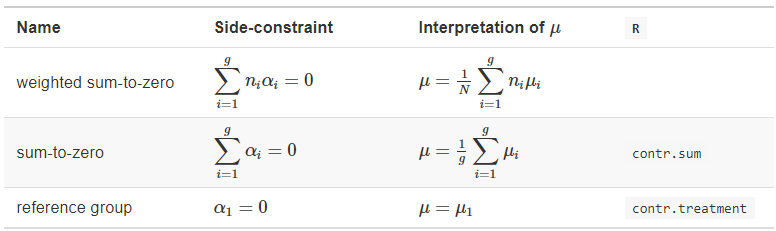

```{r setup, include=FALSE}
knitr::opts_chunk$set(comment = ">",
                      cache = TRUE,
                      cache.path = "./cache/")
options(htmltools.dir.version = FALSE,
        dplyr.width = 60,
        dplyr.print_min = 5,
        dplyr.print_max = 5)

library(tidyverse)
library(multcomp)
```

class: center, middle, inverse
# Part I
# Working with factors

---
## 'forcats' package

Tidyverse package with useful functions for dealing with factors

--

### Dummy data

Overly complicated way to create a dataset

.pull-left[
```{r}
dt <- data.frame(
  x = LETTERS[1:2]
  ) %>% 
  group_by(x) %>% 
  do({
    data.frame(
      .,
      y = rep(LETTERS[4:6],3:1)
    )
  }) %>% 
  ungroup()
```
]
.pull-right[
```{r}
dt %>% print(n = 9)
```
]

---
## 'forcats' package

Main functions

 - fct_c
 
 - fct_collapse
 
 - fct_recode
 
 - fct_lump
 
 - lvls_reorder/fct_reorder
 
 - fct_relevel

---
## Combining factors

```{r}
f1 <- factor(rep(c("a", "b"), 2))
f2 <- factor(rep(c("c", "d"), 2))

f1
f2
c(f1, f2)
c(as.character(f1), as.character(f2)) %>% as.factor()
```

---
## Combining factors levels

```{r}
fct_c(f1, f2)
```
--

## Grouping levels

```{r}
factor <- factor(c("a","a","a","b","b", "c", "d", "e"))
fct_collapse(factor, b2 = c("b", "c"), a2 = c("a", "d"))
fct_recode(factor, b2 = "b", b2 = "c", a2 = "a", a2 = "d")
fct_lump(factor, n = 2, other_level = "other")
```

---
## Grouping levels

- Note about **`fct_lump()`**: if `n` (and `prop`) are missing, `fct_lump` lumps together the least frequent levels into "other", while ensuring that "other" is still the smallest level

Together with **`dplyr`**, we have

```{r}
dt %>% 
  mutate(y = fct_lump(y, 5, 'other')) %>% 
  print(n = 10)
```

---
## Reordering levels

- To reorder a factor levels in base R we would need to create a new factor with the desired level ordering

--

- With **`fct_reorder()`** from forcats:

```{r}
factor <- factor(letters[1:10])
lvls_reorder(factor, idx = 10:1)
```

--

- Re-order based on a function

```{r}
factor <- factor(c("a","a","a","b","b","c"))
vector <- c(1,2,3,1,1,1.2)
tapply(vector, factor, mean)
fct_reorder(factor, vector, mean)
```

---
## Reordering levels

- **`fct_relevel()`**, pulls the desired levels to the beginning of the level vector

```{r}
factor <- factor(c("a","a","a","b","b","c"))
factor
fct_relevel(factor, "c")
fct_relevel(factor, "b","c")
```

---
class: center, middle, inverse
# Part II
# Analysis of Variance

---
## Main packages and functions

- **`aov()`** (type 1 SS - sequential)

- **`lm()`** (type 3 SS - marginal)

- **`forcats`** for dealing with factors

--

- Default parametrization is first level of aech factor as reference (set to zero)

.center[]

---
## Know you parametrization/SS

- consider balanced/unbalanced data with/without missing values

- Don't assume what comes out of any software to be 100% correct. Read the documentation carefully.

--

- Ex: function **Anova()** from **car** package that allow us to compute type II/III SS help says

.center[]

---
## SS relationships

.center[]

- The type of SS to use on unbalanced designs is not a consensus among statisticians and software 

- They all have pros and cons regarding interpretation and power

???
There is NO consensus on which type of SS should be used for unbalanced designs, but most statisticians generally recommend type III, which is the default in most software packages such as SAS, SPSS, JMP, Minitab, Stata, Statista, Systat, and Unistat while R, S-Plus, Genstat, and Mathematica use type I. However, Langsrud (2003) argues that Type II is preferable considering the power of types II and III.

---
## ANOVA in R - Data

```{r}
library(datasets)
glimpse(ToothGrowth)
```

A data frame with 60 observations on 3 variables.

- `len`	 Tooth length
- `supp` Supplement type (VC or OJ).
- `dose` Dose in milligrams/day

```{r}
xtabs(~ supp + dose, data = ToothGrowth)
```

---
## ANOVA in R - descriptive analysis

```{r}
sum <- ToothGrowth %>% 
  group_by(supp, dose) %>% 
  summarise_all(list(m = mean,
                     sd = sd,
                     n = length))
print(sum, n=10)
```

---
## ANOVA in R - descriptive analysis

```{r, echo=T, message=F, warning=F, fig.width=7, fig.height=5, fig.align='center'}
ToothGrowth %>% 
  ggplot() +
  geom_boxplot(aes(x = supp, y = len))
```

---
## ANOVA in R - descriptive analysis

```{r, echo=T, message=F, warning=F, fig.width=7, fig.height=5, fig.align='center'}
ToothGrowth %>% 
  ggplot() +
  geom_boxplot(aes(x = dose, y = len))
```

---
## ANOVA in R - descriptive analysis

```{r, echo=T, message=F, warning=F, fig.width=7, fig.height=5, fig.align='center'}
ToothGrowth %>% 
  ggplot() +
  geom_boxplot(aes(x = dose, y = len, fill = supp))
```

---
## ANOVA in R - descriptive analysis

```{r, echo=T, message=F, warning=F, fig.width=7, fig.height=5, fig.align='center'}
sum %>% 
  ggplot(aes(x=dose, y=m, group=supp, color=supp)) + 
  geom_line(size = 1.1) + geom_point(size = 1.2) +
  geom_errorbar(aes(ymin=m-sd, ymax=m+sd), width=.2,
                 position=position_dodge(0.05), size = 1.1)
```

---
## ANOVA in R - model fitting

```{r}
ToothGrowth$dose <- factor(ToothGrowth$dose)
mod <- lm(len ~ supp + dose, data = ToothGrowth)
summary(mod)
```

---
## ANOVA in R - model fitting

```{r}
anova(mod)
car::Anova(mod, type = 3)
```

---
## ANOVA in R - model fitting

```{r}
TG2 <- ToothGrowth
contrasts(TG2$supp)
contrasts(TG2$dose)
```

--

To change the default contrasts we can do

```{r}
contrasts(TG2$supp) <- contr.sum(2)
contrasts(TG2$dose) <- contr.treatment(c("0.5", "1", "2"),
                                       base = 3)
```

---
## ANOVA in R - model fitting

Now

```{r}
contrasts(TG2$supp)
contrasts(TG2$dose)
```

---
## ANOVA in R - model fitting

```{r}
mod2 <- lm(len ~ supp + dose, data = TG2)
summary(mod2)
```

---
## ANOVA in R - model fitting

- Changes on parametrizations as arbitrary

- Usually a better idea to control the reference level of the factors

---
## ANOVA in R - comparing models

```{r}
mod3 <- lm(len ~ supp * dose, data = ToothGrowth)
summary(mod3)
```

---
## ANOVA in R - comparing models

We can test the interaction term doing

```{r}
anova(mod, mod3)
```

---
## ANOVA in R - post-hoc tests


- Package **`multcomp`**: library of functions for testing linear hypothesis

.center[]

---
## ANOVA in R - post-hoc tests

--

- Multiple comparisons via Tukey's HSD (Honest Significant Differences)

```{r}
library(multcomp)
test <- glht(mod, linfct = mcp(dose = "Tukey"))
summary(test)
```

---
## ANOVA in R - post-hoc tests

- Dunnet _one-to-many_ comparisons against a reference category

```{r}
test <- glht(mod, linfct = mcp(dose = "Dunnett"))
summary(test)
```

---
## ANOVA in R - post-hoc tests

- General linear hypothesis 

```{r}
lht <- glht(mod, linfct = c("dose2 - dose1 = 0",
                             "suppVC = 0"))
summary(lht, test = adjusted(type = "bonferroni"))
```

---
## ANOVA in R - post-hoc tests

- For unadjusted p-values

```{r}
lht <- glht(mod, linfct = c("dose2 - dose1 = 0",
                             "suppVC = 0"))
summary(lht, test = adjusted(type = "none"))
```

---
## ANOVA in R -  post-hoc CIs

```{r}
confint(test)
```

---
## ANOVA in R -  post-hoc CIs

```{r}
ci <- confint(lht, calpha = 0.05/2)
ci
```

---
## ANOVA in R -  post-hoc CIs

```{r, echo=T, message=F, warning=F, fig.width=7, fig.height=6, fig.align='center'}
plot(test)
```


