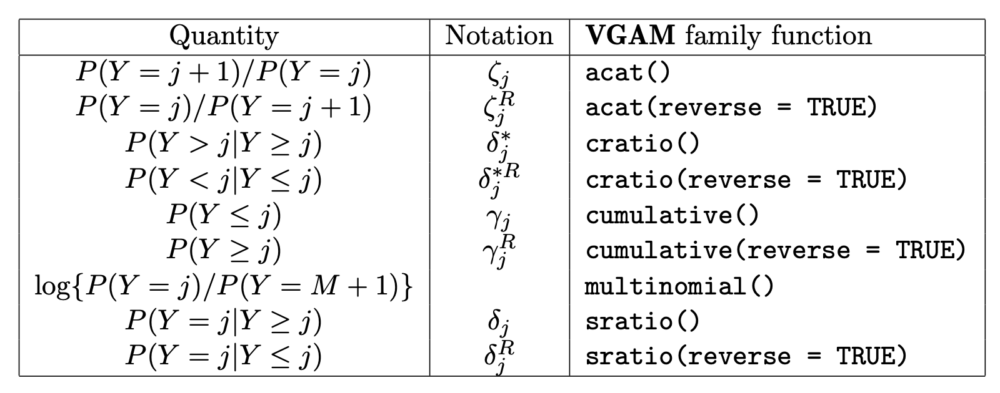

```{css}
.tiny .remark-code {
  font-size: 70% !important;
}
```

```{r setup, include=FALSE}
knitr::opts_chunk$set(comment = ">",
                      cache = FALSE,
                      cache.path = "./cache/")
options(htmltools.dir.version = FALSE,
        dplyr.width = 60,
        dplyr.print_min = 5,
        dplyr.print_max = 5)

library(tidyverse)
library(broom)
library(VGAM)
```
---

class: center, middle, inverse
# Part I
# Generalized Linear Models

---
## GLMs in R

- Most GLMs can be fit without the need of additional packages

- **`glm(y ~ x, family = <distribution>(<link function>))`**
  - binomial(link = "logit")
  - gaussian(link = "identity")
  - Gamma(link = "inverse")
  - inverse.gaussian(link = "1/mu^2")
  - poisson(link = "log")
  - quasi(link = "identity", variance = "constant")
  - quasibinomial(link = "logit")
  - quasipoisson(link = "log")

.center[]

???
can be useful cloglog is useful when we have too many zeros

---
## GLMs in R

- Cases not in R base

  - Negative binomial - **`MASS`** package
   
  - Zero-truncated Poisson and NB - **`VGAM`** package
  
  - Zero-inflated Poisson and NB - **`pscl`** package

--

## Data

(Wellknown) Horseshoe Crabs and satellites study: female horseshoe crab in the study had a male crab attached to her in her nest. The study investigated factors that affect whether the female crab had any other males, called satellites, residing near her

- There are 173 females in this study
  - female crab’s color
  - spine condition
  - weight
  - carapace width
  - number of satellites

---
## Data

```{r, fig.width=7, fig.height=3.5, fig.align='center'}
crabs <- readxl::read_xlsx("./data/crabs.xlsx"); crabs
hist(crabs$satellites)
```

---
## Model fitting

.tiny[
```{r}
fit <- glm(satellites ~ weight,
           family = poisson(link = "log"), data = crabs)
summary(fit)
```
]

---
## Model fitting

- the wider the female crab, the greater expected number of male satellites

- $e^{0.164} \approx$ `r round(exp(0.164), 2)`. For one unit of increase in the width, the number of satellites will increase by a factor of 1.18 (or increase 18%)

### Deviance GOF

```{r}
1 - pchisq(fit$deviance, fit$df.residual)
```

- The lack of fit maybe due to missing data, covariates or overdispersion

---
## Model fitting - overdispersion

For Poisson, dispersion parameter should be 1

```{r}
fit$deviance/fit$df.residual
```

- Hence, variance is almost three times the mean

--

**What do we do?**

--

- Scale standard errors

```{r}
sqrt(.01997^2*3.32)
```


- Negative Binomial regression

- Quasilikelihood regression

---
## Model fitting - overdispersion

.tiny[
```{r}
summary(fit, dispersion = 3.32)
```
]

---
## Model fitting - overdispersion

.tiny[
```{r}
fit2 <- glm(satellites ~ weight,
           family = quasipoisson(link = "log"), data = crabs)
summary(fit2)
```
]

---
## Model fitting - overdispersion

If we want to stay on the likelihood paradigm, we can try NB

.tiny[
```{r}
fit_nb <- glm.nb(satellites ~ weight, data = crabs)
summary(fit_nb)
```
]

---
## Model fitting - overdispersion

LR test for overdispersion (NB model is a Poisson model with Gamma errors)

```{r}
x2 <- -2*(logLik(fit)-logLik(fit_nb)); x2
.5*(1 - pchisq(as.numeric(x2), df = 1)) #50:50 chisq
pscl::odTest(fit_nb)
```

Did it help?

```{r}
1 - pchisq(fit_nb$deviance, fit_nb$df.residual)
```

???
.5*P(X0 > T) + .5*P(X1 > T)

---
## Modeling the rate

For grouped data, we can model the rate $\lambda_i$ using an *offset* term

$$\log(\lambda_i) = \boldsymbol{X \beta} \\
\log(\mu_i/n_i) = \boldsymbol{X \beta} \\
\log(\mu_i) = \log(n_i) + \boldsymbol{X \beta}$$

```{r}
crabs_gr <- crabs %>% 
  mutate_at(vars(color, spine_condition), as.factor) %>% 
  group_by(color, spine_condition) %>% 
  summarise(satellites = sum(satellites),
            log_n = log(n())) %>% 
  ungroup()
```

---
## Modeling the rate

```{r}
crabs_gr %>% print(n = 12)
fit_gr <- glm(satellites ~ color + spine_condition, 
              offset = log_n, family = poisson(), data = crabs_gr)
```

---
## Modeling the rate

.tiny[
```{r}
summary(fit_gr)
```
]

---
## Modeling the rate

```{r}
anova(fit_gr, test = "Rao")
```

---
## Modeling the rate

```{r}
coef <- tidy(fit_gr, exponentiate = T, conf.int = T)
coef[,1:5]
coef[,c(1, 6:7)]
```

---
## Multinomial Regression

- **VGAM** package and the **vglm()** function

.center[]

--

- **Data:** Pneumoconiosis in coalminers data (McCullagh and Nelder, 1989)

  - The pneumo data frame has 8 rows and 4 columns
  
  - Exposure time (in years) is explanatory, and there are 3 ordinal response variables (normal, mild, sevire)

---
## Multinomial Regression

```{r}
library(VGAM)
as_tibble(pneumo) %>% print(n=8)
```

---
## Multinomial Regression - proportional odds

.tiny[
```{r}
fit <- vglm(cbind(normal, mild, severe) ~ exposure.time,
            cumulative(parallel = TRUE, reverse = TRUE), data = pneumo)
summary(fit)
```
]

---
## Multinomial Regression - proportional odds

```{r}
cbind(coef(fit), confintvglm(fit)) %>% exp() %>% round(2)
```

---
## Multinomial Regression - proportional odds

.tiny[
```{r}
fit3 <- vglm(cbind(normal, mild, severe) ~ exposure.time,
            cumulative(parallel = FALSE, reverse = TRUE), data = pneumo)
summary(fit3)
```
]

---
## Multinomial Regression - proportional odds

- Check the proportional odds assumption with a LRT

```{r}
lrtest(fit3, fit)
```

---
## Multinomial Regression - general logit

- **Data:** marital data mainly from a large NZ company collected in the early 1990s.

  - age: a numeric vector, age in years
  
  - ethnicity: a factor with levels European Maori Other Polynesian. Only Europeans are included in the data set
  
  - mstatus: a factor with levels Divorced/Separated, Married/Partnered, Single, Widowed.
  
```{r}
as_tibble(marital.nz)
```

---
## Multinomial Regression - general logit
.tiny[
```{r}
fit4 <- vglm(mstatus ~ age, multinomial(refLevel = 1), data = marital.nz)
summary(fit4)
```
]


---
## Models for skewed data

- Positive continuous data: **family = gamma/inverse.gaussian**

- Positive continuous data with exact zeros: **family=tweedie** using package **statmod**

--

- Example: hospital length-of-stay (time in general)

```{r, fig.width=7, fig.height=3.5, fig.align='center'}
library(NHSRdatasets)
ggplot(LOS_model, aes(x = LOS)) +
  geom_histogram(bins = 20, fill = "lightblue", col = 1)
```


